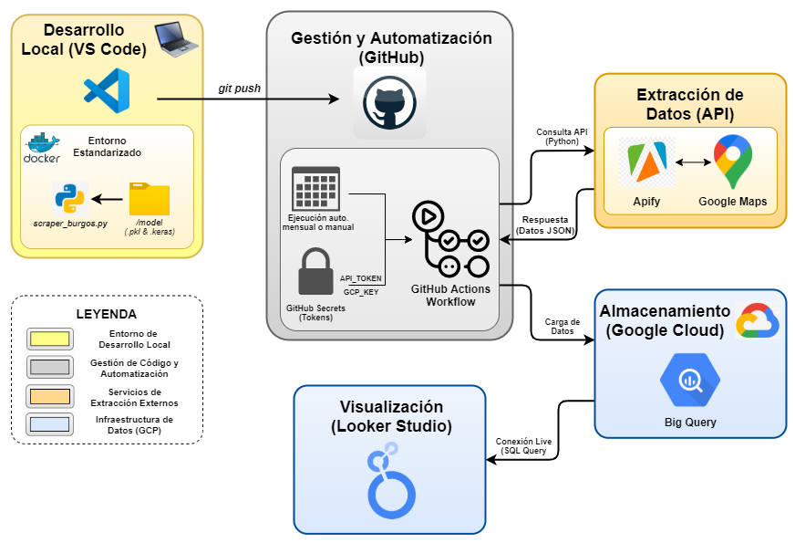

# Trabajo de Fin de Grado: Digitalización del Boletín de Turismo del Observatorio de la Provincia de Burgos

## Descripción
Este repositorio contiene el código y la configuración de mi **Trabajo de Fin de Grado** para el Grado en Ingeniería Informática. El objetivo del proyecto es automatizar la recogida y el análisis de datos para el Observatorio de Turismo de la Provincia de Burgos mediante una arquitectura automática basada en la nube.

He desarrollado un sistema que automatiza todo el proceso de obtención de información turística desde Google Maps. El flujo no solo extrae las reseñas y datos de los puntos de interés de la provincia, sino que aplica **Inteligencia Artificial** para analizar el sentimiento de las opiniones de los usuarios.

Gracias a esta arquitectura, se sustituyen los procesos manuales por un flujo continuo que permite monitorizar la percepción de los turistas en la provincia de manera actualizada y eficiente.

## Arquitectura del Sistema:
El proyecto se organiza en diferentes etapas conectadas entre sí, tal y como se muestra en el siguiente diagrama:

1.  **Desarrollo Local:** Programación del sistema en **VS Code** con **Python 3.13**. He incluido **Docker** para asegurar que el entorno sea siempre el mismo y no haya fallos de configuración.
2. **Automatización (GitHub):** Uso de **GitHub Actions** para programar la ejecución automática (una vez al mes) y **GitHub Secrets** para guardar de forma segura las llaves de acceso (Tokens).
3. **Extracción (Apify):** Conexión con la API de Apify para obtener de forma automática las reseñas y metadatos de los sitios de interés.
4. **IA y Procesamiento:** Limpieza del texto y análisis de sentimientos mediante un modelo local basado en **Keras y TensorFlow** alojado en la carpeta `/model`.
5. **Almacenamiento (BigQuery):** Los datos procesados y analizados se guardan en el almacén de datos de **Google Cloud**.
6. **Visualización (Looker Studio):** Creación de un panel interactivo que lee los datos de BigQuery para mostrar mapas y estadísticas de forma visual.

## Características Principales
- **Automatización:** El sistema funciona de forma autónoma gracias a las tareas programadas de GitHub.
- **Análisis de IA:** Integración de un modelo de aprendizaje automático para clasificar las reseñas en positivas o negativas.
- **Entorno Robusto:** Uso de contenedores para garantizar que el código funcione en cualquier servidor.
- **Datos en tiempo real:** Conexión directa entre la base de datos y el panel de visualización.

## Stack Tecnológico
- **Lenguaje:** Python 3.13
- **Infraestructura:** Docker y GitHub Actions
- **Nube:** Google Cloud (BigQuery y Looker Studio)
- **Extracción de datos:** Apify API
- **IA y Datos:** Keras, TensorFlow, Scikit-learn y Pandas

## Documentación
 - Enlace al proyecto de Overleaf: https://es.overleaf.com/read/fzzwvrnxrcdr#0e99cb
 
## Autor
  Nicolás Pérez Ibáñez

## Tutores
 - Bruno Baruque Zanón
 - Julio César Puche Regaliza

## Licencia
El proyecto se encuentra bajo una licencia CC BY-NC-SA 4.0. Para más información, consulta el fichero [LICENSE](https://github.com/Nicop17/TFG-Boletin-Turismo-Burgos/blob/main/LICENSE)
