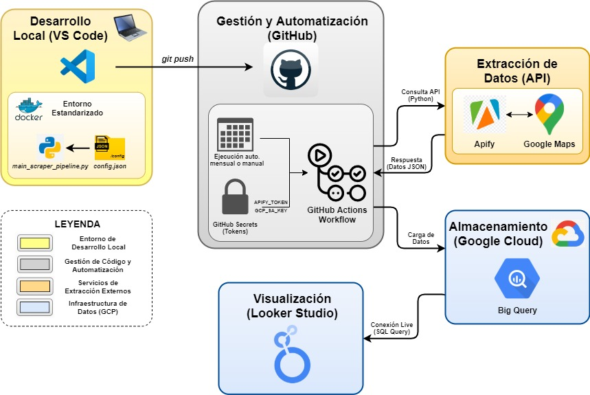

# Trabajo de Fin de Grado: Digitalización del Boletín de Turismo del Observatorio de la Provincia de Burgos

## Descripción
Este repositorio contiene el código fuente, la infraestructura y la configuración de mi **Trabajo de Fin de Grado** para el Grado en Ingeniería Informática en la Universidad de Burgos (UBU). El objetivo principal del proyecto es automatizar por completo la recopilación, limpieza y análisis de reseñas de usuarios para el Observatorio de Turismo de la Provincia de Burgos mediante una arquitectura automática basada en la nube.

Se ha desarrollado un pipeline ETL (Extracción, Transformación y Carga) robusto en Python que extrae de forma masiva e incremental información y reseñas de puntos de interés (POIs) de la provincia desde Google Maps. El sistema integra procesamiento del lenguaje natural (NLP) para detectar idiomas y traducir reseñas, además de calcular el grado de satisfacción de los visitantes, sustituyendo las auditorías manuales por un flujo de datos continuo que permite monitorizar la percepción de los turistas en la provincia de manera actualizada y eficiente.

## Arquitectura del Sistema:
El proyecto se organiza en diferentes etapas conectadas entre sí, tal y como se muestra en el siguiente diagrama:

1. **Desarrollo Local y Entorno (VS Code & Docker):** Programación del sistema en **Python 3.13** coordinada por el archivo principal `main_scraper_pipeline.py`. El comportamiento y las reglas de negocio del programa se parametrizan de forma externa a través del archivo `config/config.json` sin necesidad de tocar el código fuente. Todo el entorno se encapsula en contenedores **Docker** para garantizar su portabilidad e independencia del sistema anfitrión.
2. **Automatización (GitHub):** El código se almacena en el repositorio de GitHub. Además se hace uso de **GitHub Actions** para programar la ejecución automática del script de manera periódica (o lanzarlo de forma manual bajo demanda). Se utiliza **GitHub Secrets** para guardar de forma segura las llaves privadas de acceso (`APIFY_TOKEN` y `GCP_SA_KEY`).
3. **Extracción (Apify):** Conexión con la API externa de Apify para ejecutar los rastreadores automáticos en Google Maps. El sistema envía los parámetros de búsqueda y recibe las respuestas con los datos de los puntos de interés y reseñas en formato `JSON`.
4. **Almacenamiento (BigQuery):** Los datos procesados y analizados se guardan en el almacén de datos de **Google Cloud** a través de sentencias `MERGE` para evitar duplicados.
5. **Visualización (Looker Studio):** Creación de un panel interactivo que lee los datos de BigQuery para mostrar mapas y estadísticas de forma visual y automática.

## Características Principales
- **Personalización y filtros:** Permite cambiar el comportamiento del scraper desde el archivo `config.json`, pudiendo limitar la ejecución a un único municipio, categoría o POI concreto para obtener unos resultados de extracción personalizados además de configurar numerosos parámetros del sistema.
- **Rastreo incremental e inteligente:** El sistema cuenta con marcas de control temporales (*checkpoints*) y un sistema de cortocircuito en caliente que detiene la descarga de reseñas al detectar el primer registro ya almacenado, evitando descargas redundantes y ahorrando costes de API.
- **Cálculo del TORI:** Implementación de una consulta para el cálculo automático del *Tourism Online Reputation Index*, escalando y ponderando la valoración media de Google Maps con el sentimiento NLP obtenido de los textos de las reseñas.
- **Tolerancia a fallos:** Todo el flujo algorítmico y las llamadas a servicios externos están protegidos mediante control de excepciones e históricos de ejecución en archivos físicos `logs/`, garantizando que un fallo de red o un dato corrupto en un local aislado no detenga el procesamiento global de la provincia.

## Stack Tecnológico
- **Lenguaje principal:** Python 3.13 e instrucciones lógicas en SQL (BigQuery Dialect).
- **Infraestructura y Cloud:** Docker, Docker Compose, GitHub Actions y Google Cloud Platform (BigQuery).
- **Extracción de datos:** Apify Client API.
- **Procesamiento de texto y NLP:** `pysentimiento`, `deep-translator`, `langdetect` y `gender-guesser`.
- **Visualización:** Looker Studio.

## Enlaces de interés
 - **Documentación**: [Proyecto Overleaf](https://es.overleaf.com/read/fzzwvrnxrcdr#0e99cb)
 - **Dashboard:** [Dashboard en Looker Studio](https://datastudio.google.com/reporting/57960b6b-29fb-41fa-84f3-e6e0fd5e770a)
 
## Autor
  Nicolás Pérez Ibáñez

## Tutores
 - Bruno Baruque Zanón
 - Julio César Puche Regaliza

## Licencia
Este proyecto está sujeto a los términos legales de la licencia **CC BY-NC-SA 4.0**. Para más información, consulta el fichero [LICENSE](https://github.com/Nicop17/TFG-Boletin-Turismo-Burgos/blob/main/LICENSE)
